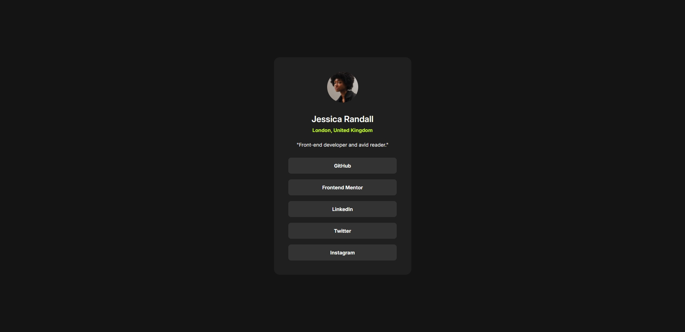

# Social-links-profile-main

Essa é uma solução da [Social links Challenge](https://www.frontendmentor.io/challenges/social-links-profile-UG32l9m6dQ). O maior objetivo era replicar um design sem ter acesso ao Figma do projeto, pois a plataforma possui uma assinatura que limita o acesso a ele.

## Tabela de Conteúdo

- [Overview](#overview)
  - [Screenshot](#screenshot)
  - [Link](#link)
- [Meu processo](#meu-processo)
  - [Construído com](#construído-com)
  - [O que aprendi](#o-que-aprendi)
- [Criado por](#criado-por)

## Overview

### Screenshot

### Link

- Site para consulta ao vivo: [Clique aqui](https://isaonline.github.io/Social-links-profile-main/)

---

## Meu processo

### Construído com

- HTML5
- CSS
- Flexbox
- Variáveis
- Figma

### O que aprendi

Foi um grande desafio desenvolver esse projeto, principalmente por não ter disponível o design original para consulta, rapidamente ficou clara a dificuldade intensa em não ser possível comparar diretamente como anteriormente, ao menos o arquivo de style guide com informações básicas que foi disponibilizado ajudou em definir cores e fontes.
Felizmente, pude exercitar meu histórico em design para o restante do projeto: reproduzi as formas básicas das telas dentro do Figma, desenvolvi o projeto tomando cuidado com tamanhos, espaçamentos e tudo que poderia comprometer a fidelidade à ideia original e pude finalizar tudo sem problemas.

### Criado por

- LinkedIn - [Isabelle Nascimento](https://www.linkedin.com/in/isanasc/)
- Frontend Mentor - [@isaonline](https://www.frontendmentor.io/profile/isaonline)